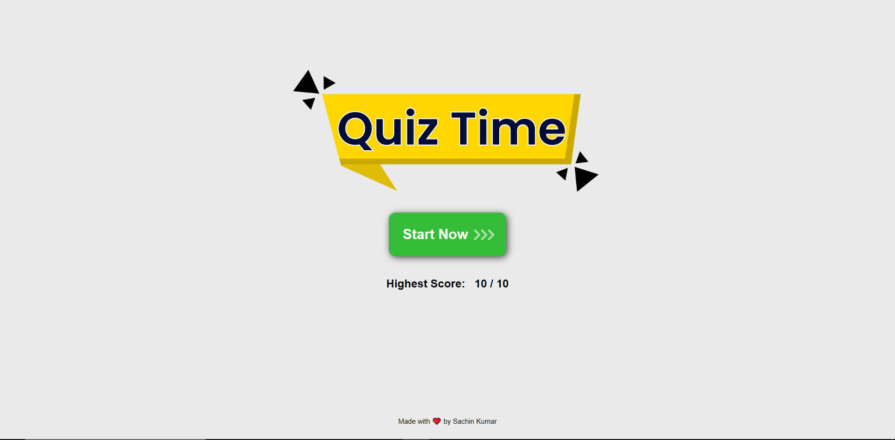
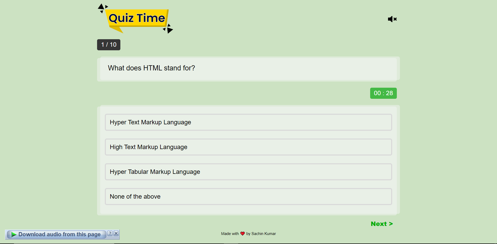
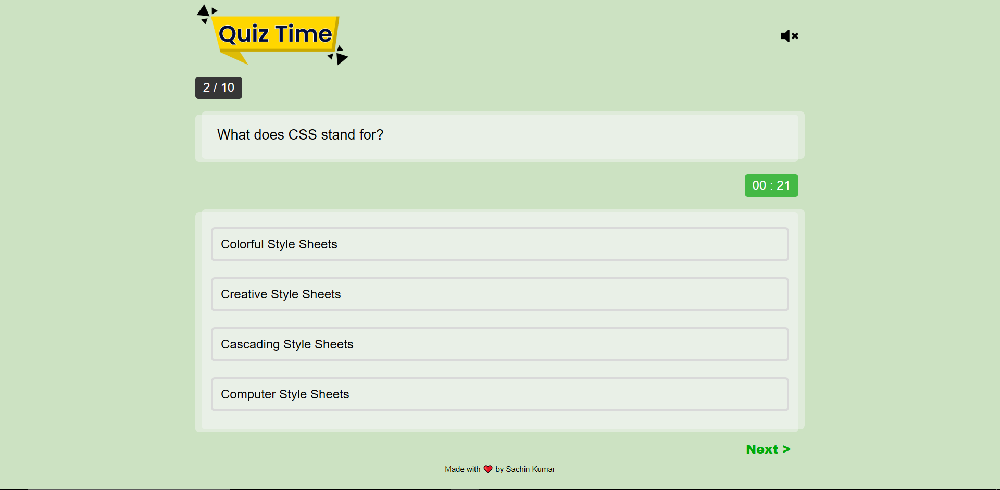

# Dynamic Quiz Application

A responsive and interactive web-based quiz application built with vanilla JavaScript, HTML, and CSS. This project showcases modern front-end development techniques, including dynamic DOM manipulation, event handling, state management with `localStorage`, and CSS animations.

**Live Demo:** [(https://quiz-app-22-flame.vercel.app)]





## ✨ Key Features

*   **Interactive Quiz Interface:** A clean and user-friendly UI for an engaging quiz experience.
*   **Timed Questions:** Each question has a 30-second timer to add a challenging element.
*   **Dynamic UI Updates:** The background color changes from green to yellow to red as time runs out, creating a sense of urgency.
*   **Instant Feedback:** Users receive immediate visual (color-coded answers, icons) and audio feedback upon selecting an answer.
*   **Audio Control:** Ability to mute and unmute sound effects.
*   **Animated Results Page:** A visually appealing results screen that displays:
    *   The final score as a percentage with an animated counter.
    *   A dynamic SVG circular progress bar that animates based on the user's score.
    *   Personalized feedback messages depending on performance.
*   **Score Persistence:** The application uses `localStorage` to track and display the user's highest score across sessions.
*   **Responsive Design:** The layout is fully responsive and works seamlessly on desktops, tablets, and mobile devices.
*   **Modular Code:** JavaScript is organized into ES6 modules for better maintainability and readability.

## 🛠️ Technologies Used

*   **HTML5:** For the structure and content of the application.
*   **CSS3:** For styling, layout, responsive design, and animations (including dynamic `@keyframes`).
*   **JavaScript (ES6+):** For all application logic, DOM manipulation, interactivity, and state management.

## 🚀 How to Run Locally

1.  Clone the repository:
    ```bash
    git clone https://github.com/Sachin-Engineer/Quiz-App.git
    ```
2.  Navigate to the project directory:
    ```bash
    cd Quiz-App
    ```
3.  Open the `index.html` file in your web browser.
    *(For the best experience, use a live server extension in your code editor, like the "Live Server" for VS Code).*

---
_This project was created as a demonstration of core front-end web development skills._
